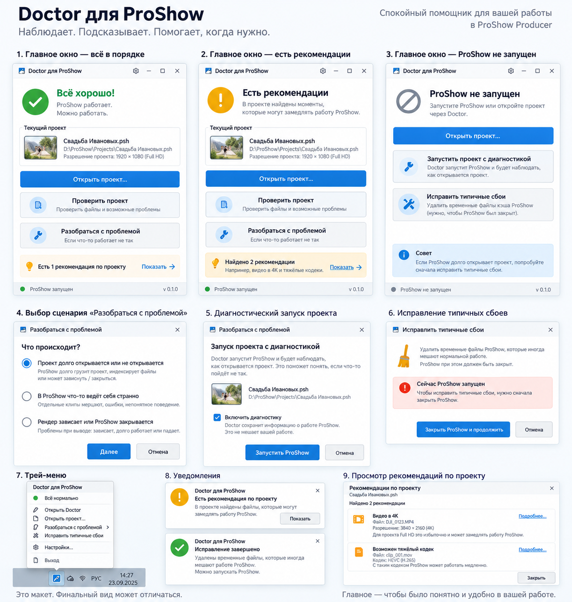
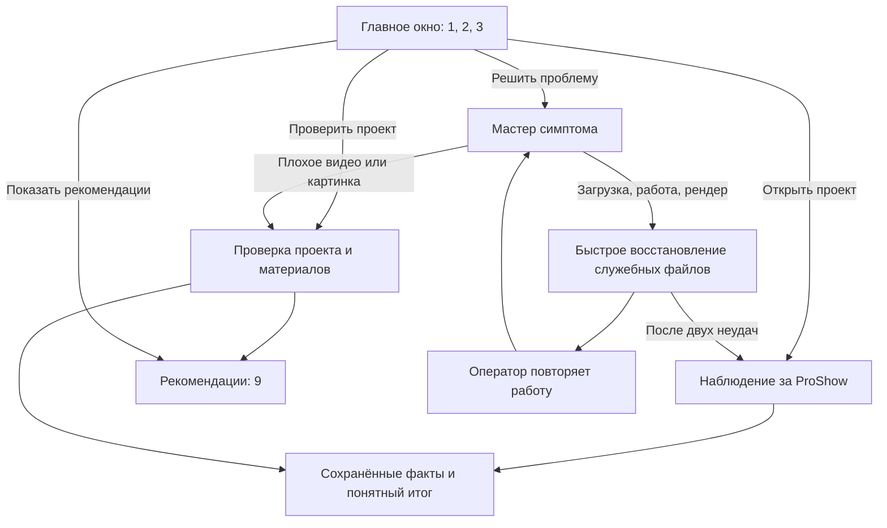

# Doctor для ProShow — спецификация интерфейса

Статус: **поведение и направление оформления заданы владельцем 19.09.2026** после просмотра первой версии на стенде. Макет показывает разные состояния одного главного окна и связанные с ним диалоги. Точная геометрия и формулировки проверяются с Олей. Имена проекта и пути на картинке — условные примеры.

## Пользовательский договор

Doctor — небольшая спокойная программа в трее. Она присутствует, когда работа идёт нормально; ненавязчиво сообщает о замеченном в проекте; помогает при уже возникшей проблеме. В любой момент Оля должна понять: **что сейчас происходит, какой проект имеется в виду, есть ли причина что-то делать и какое действие доступно**.

Главное окно говорит только о работе пользователя. В нём нет `Observer`, `ETW`, `PID`, `JSONL`, названий внутренних правил, сценариев стенда и сетевых адресов. Workbench — инженерный пульт владельца, не часть интерфейса Оли. Слова о «лечении кэшей» не занимают верх главного окна: это одно конкретное действие, а не назначение всего Doctor.

Этот документ уточняет [первый раунд дизайна](../tier1/README.md) для ближайшей пользовательской версии. В частности, макет задаёт компактную сводку вместо экрана со списком лечебных решений и более полезное меню трея вместо прежнего меню из одного пункта. Старые документы сохраняются как история решений. Безопасность оригиналов и право пользователя продолжать работу сохраняются.

## Карта поверхностей

| № на макете | Что это | Переход |
| --- | --- | --- |
| 1 | Главное окно: спокойно | Можно работать или выбрать действие |
| 2 | То же окно: есть рекомендации | «Показать» ведёт к №9; работа не блокируется |
| 3 | То же окно: ProShow закрыт | Обычное открытие, диагностический запуск, исправление |
| 4 | Выбор симптома | «Далее» ведёт к нужному способу наблюдения |
| 5 | Подтверждение диагностического запуска проекта | Doctor запускает ProShow и сохраняет наблюдения |
| 6 | Исправление типичных сбоев | Закрытие ProShow при необходимости, затем безопасная очистка |
| 7 | Меню трея | Быстрый вход в те же действия |
| 8 | Уведомления | Короткий факт и, когда нужно, «Показать» |
| 9 | Рекомендации по проекту | Спокойные карточки с фактами и подробностями |

## Постоянный каркас главного окна

Окно компактное, вертикальное, приблизительно 380–420 логических пикселей в ширину и 500–560 в высоту при масштабе 100%. Оно подстраивается под масштаб Windows и длинный путь проекта: элементы не обрезаются. Светлый фон, тонкие границы карточек, один синий акцент для основного действия. Зелёный — спокойное состояние, жёлтый — рекомендация, серый — ProShow закрыт, красный — препятствие конкретному действию. Цвет всегда повторяется словами и значком.

Сверху только строка окна «Doctor для ProShow», шестерёнка настроек и обычные системные кнопки. **Большого повторного названия и рекламного подзаголовка внутри окна нет.** Ниже по одному ритму располагаются: статус, карточка текущего проекта, обычное открытие, холодная проверка, одна основная кнопка «Решить проблему», полоса рекомендации или совета и версия. Структура не прыгает при переходе между состояниями.

Карточка проекта показывает имя `.psh`, путь и известное разрешение. Миниатюра допускается, если её можно получить без заметной цены и изменения файлов; иначе — простой нейтральный значок. Doctor пытается определить проект, открытый обычным двойным щелчком из Проводника или из ProShow. Если определить не удалось, карточка честно говорит «Проект не определён» и даёт выбрать `.psh` вручную. Выбранный в Doctor проект и фактически открытый в ProShow не выдаются за один и тот же без подтверждения.

| Состояние | Верхний блок | Нижняя строка |
| --- | --- | --- |
| ProShow работает, известных актуальных замечаний нет | Зелёное «Всё хорошо!», «ProShow работает. Можно работать.» | «ProShow запущен» |
| Найдены рекомендации к текущему проекту | Жёлтое «Есть рекомендации», короткое объяснение без слова «поломка» | Фактический статус ProShow |
| ProShow не работает | Серое «ProShow не запущен», «Запустите ProShow или откройте проект через Doctor.» | «ProShow не запущен» |
| Состояние определить не удалось | Нейтральная строка об этом, без зелёной галочки | «Состояние неизвестно» |

«Всё хорошо!» означает **Doctor сейчас не видит причин вмешиваться**, а не гарантию, что с проектом никогда не случится сбой. Оно не должно скрывать уже найденные рекомендации. Имя проекта, разрешение, число рекомендаций и статус не подставляются из макета: либо подтверждены фактическими данными, либо прямо помечены как неизвестные.

## Основные кнопки

**«Открыть проект…»** показывает стандартный выбор `.psh` и просит ProShow открыть выбранный проект обычным способом. Это не диагностический режим. Doctor не меняет ассоциацию `.psh`, не запрещает двойной щелчок из Проводника и не закрывает уже работающий ProShow. Системные и ProShow-диалоги о несохранённой работе остаются действующими. Если реализация пока только запоминает файл, кнопка временно называется «Выбрать проект…»; ложной кнопки «Открыть» в рабочей сборке нет.

**«Проверить проект»** использует холодный путь Core: читает `.psh`, строит инвентарь, исследует доступные медиа, применяет правила и формирует рекомендации. ProShow для этого не требуется, проект не изменяется. Если `.psh` ещё не выбран, сначала открывается выбор файла. Нет значимых находок — короткое «Всё хорошо»; есть находки — главное окно переходит в №2, а подробности доступны в №9. Проверка сама по себе не запускает исправление.

**«Решить проблему»** открывает мастер. Оля сообщает бытовой симптом, а Doctor сам выбирает быстрое восстановление, проверку материала или наблюдение. Технические названия служебных файлов и кэшей в окне не показываются.

## №4. Выбор симптома

Окно спрашивает «Что происходит?» и предлагает четыре понятных варианта: **проект не открывается или долго загружается**; **ProShow зависает или закрывается во время работы**; **рендер зависает или ProShow закрывается**; **видео или картинка дают плохой результат**. Выбирается один пункт, затем «Далее» или «Отмена». Никаких режимов Observer в этом выборе нет.

Для первых трёх симптомов сначала предлагается быстрое восстановление служебных файлов. Doctor объясняет только последствия: проект и исходные материалы не меняются, но первый запуск после восстановления может быть долгим из-за повторной индексации. Если оператор сообщает, что не помогло, после первой попытки показываются свободное место и предложение открыть очистку Windows; после двух неудачных попыток основным действием становится наблюдение. Для плохого видео или картинки мастер ведёт к проверке проекта и материалов, не предлагая очистку как универсальное лечение.

## №5. Диагностический запуск и наблюдение

Перед запуском видны имя и путь выбранного проекта и фраза: «Doctor запустит ProShow и будет наблюдать, как открывается проект. Это поможет понять, если что-то пойдёт не так». Кнопка «Запустить ProShow» — явное согласие. Флажок «Включить диагностику» на эскизе пока необязателен: пользователь пришёл сюда именно за диагностическим запуском, и дублирующий флажок может быть убран после просмотра с Олей.

Doctor запускает ProShow через существующий Observer, наблюдает процессы и окна, пишет факты локально и при настроенной сети предоставляет их инженерному компьютеру. **На машине Оли Observer только наблюдает:** не нажимает кнопки, не запускает рендер, не закрывает окна, не завершает её программу. Активные лабораторные сценарии остаются за пределами этого режима.

После старта Doctor показывает один понятный статус вместо технической ленты: «Наблюдаем за ProShow. Работайте как обычно» и кнопку «Закончить наблюдение». При нормальной загрузке — «Проект открылся. Наблюдение сохранено». При долгой — «ProShow всё ещё открывает проект. Doctor продолжает наблюдение». При установленном зависании — что программа перестала отвечать, без попытки нажать за Олю. При падении — «ProShow неожиданно закрылся. Информация о сеансе сохранена». После первой попытки мастер запоминает дату и номер действия; при следующем обращении оператор отвечает, помогло ли.

Наблюдение подключается к существующему `proshow.exe` только для чтения или запускает выбранный проект под Observer. Оля воспроизводит проблему в своём темпе. Сначала собираются процессы, дочерние процессы, окна и доступные факты. Файловая активность ETW сохраняется для инженера, но не показывается потоком строк в окне Оли. Если трассировка не запустилась или потеряла события, Doctor сообщает, что полная диагностика не получилась. Режим рендера столь же пассивен: Doctor сохраняет факты при падении и продолжает наблюдать при зависании до явного завершения сеанса.

## Быстрое восстановление служебных файлов

Действие доступно только как шаг мастера. На экране — бытовое объяснение: Doctor подготовит служебные файлы заново; ProShow должен быть закрыт. Точные пути и имена не показываются оператору. Пользователь подтверждает действие кнопкой «Попробовать».

Внутри сейчас известны `proshow.phd` и `.pxc` выбранного проекта. Их не уничтожают: Doctor сохраняет исходные байты рядом под резервными именами, чтобы ProShow создал служебные файлы заново. Оператору показывается только понятное последствие и результат операции; подробности остаются в локальном журнале владельца.

Если ProShow работает, действие не выполняется: мастер просит сохранить работу и закрыть программу обычным способом. `Kill` и автоматического закрытия нет. «Отмена» не меняет файлы. После успеха оператор повторяет работу, а при следующем входе отвечает, помогло ли.

## №7. Трей и №8. Уведомления

Крестик главного окна прячет его в трей; «Выход» в меню действительно завершает пользовательский Doctor. При выходе работающий ProShow не закрывается, сохранённые диагностические факты не теряются. Трей — основной повседневный вход, хотя само окно остаётся полноценным рабочим местом.

Меню показывает короткий статус: «Всё нормально», «Есть рекомендации», «Наблюдение за ProShow» или «ProShow не запущен». Далее — «Открыть Doctor», «Открыть проект…», «Решить проблему», «Настройки…», «Выход». Пункт проблемы открывает мастер. Меню не дублирует другую логику. Настройки не нужны для первого рабочего выпуска; позднее там могут быть автозапуск, ненавязчивость уведомлений, хранение журналов и инженерное соединение. Технические параметры не торчат в главном окне.

Уведомление о рекомендации жёлтое, короткое, появляется редко и не повторяется каждые несколько минут из-за того же файла; «Показать» открывает №9. Новая рекомендация также видна полосой в главном окне и точкой на значке трея. Рекомендация не блокирует работу. Зелёное уведомление после исправления только подтверждает итог; нажимать ничего не требуется. Обычный рабочий день не сопровождается всплывающими объяснениями устройства Doctor.

## №9. Рекомендации по проекту

Вверху — имя проекта и число рекомендаций. Каждая карточка содержит понятное название, затронутый файл, значимый факт и объяснение влияния на работу. «Подробнее…» раскрывает, где файл используется, сколько раз и почему Doctor обратил на него внимание. Примеры с макета: **4K-видео в Full HD проекте** и **возможный тяжёлый кодек HEVC/H.265**. Формулировка «может замедлять» намеренна: совпадение не доказывает причину конкретного сбоя.

Здесь только сигнализация. Нет автоматического перекодирования и кнопки «вылечить всё». Части наблюдений могут сохраняться для владельца, не показываясь Оле. Если значимых рекомендаций нет, окно говорит об этом одной фразой. «Закрыть» возвращает к главному окну.

## Пять реальных цепочек

1. **Обычный день.** Оля открывает `.psh` из Проводника или последний проект из ProShow. Doctor замечает программу, по возможности определяет проект и остаётся спокойным в трее. Если обнаружен подтверждённый повод, сообщает один раз; Оля может продолжать работу.
2. **Проект не открывается.** Трей → Doctor → «Решить проблему» → быстрый способ → повтор → при двух неудачах наблюдение. История попыток сохраняется.
3. **В открытом ProShow странности.** Выбор симптома → пассивное подключение → Оля воспроизводит проблему как обычно → Doctor сохраняет факты → «Закончить наблюдение».
4. **Проблемный рендер.** Выбор симптома → наблюдение → Оля запускает вывод сама. Если ProShow падает, собранное остаётся; если прошлый сбой произошёл до наблюдения, Doctor этого не скрывает.
5. **Плохой материал.** «Решить проблему» → «Видео или картинка дают плохой результат» → проверка проекта и исходников → рекомендация конкретного действия без обещания, что служебное восстановление всё исправит.

## Граница между макетом и нынешним кодом

| Уже есть на 19.09.2026 | Ещё требуется для этого интерфейса |
| --- | --- |
| App с треем, проверкой процессов, ручным выбором `.psh` и безопасным сохранением известных служебных файлов; стенд проверил отказ при работающем ProShow и сохранение файлов после закрытия | Проверить мастер на стенде и проверить историю попыток |
| Core/CLI умеют читать `.psh`, строить инвентарь и применять правила | Показать результаты человеческими фразами и проверить качество рекомендаций на реальных проектах |
| Observer умеет запускать ProShow, собирать факты и отдавать их по сети | Подключить App к диагностическому запуску и добавить безопасное пассивное подключение к существующему процессу |
| Workbench даёт владельцу инженерный обзор | Оставить инженерные факты вне окна Оли; для диагностики странного поведения и рендера добавить ETW и пассивное подключение по Э4.2–Э4.3 |

Нарисованная кнопка попадает в рабочую сборку только с работающим действием. Если этап ещё не готов, её надпись описывает то, что она действительно делает, либо она явно недоступна. Никаких демонстрационных имён проектов, счётчиков рекомендаций и зелёных диагнозов, зашитых в интерфейс, нет.

## Критерии просмотра с владельцем и Олей

- На стенде сразу узнаётся композиция макета: статус, проект, обычная проверка и одна кнопка «Решить проблему»; нет огромного заголовка и технических названий файлов.
- Каждая активная кнопка ведёт к обещанному результату. Отмена возвращает без изменения файлов; главное окно закрывается в трей, «Выход» завершает Doctor.
- Проект, разрешение, число рекомендаций и наблюдаемый процесс подтверждены реальными данными. Неизвестное названо неизвестным.
- Диагностические сценарии на машине Оли не управляют ProShow. Данные о проблемном сеансе сохраняются локально и доступны инженеру по настроенной сети.
- При работающем ProShow восстановление не трогает служебные файлы; при разрешённом действии старые файлы остаются восстановимыми.
- Масштаб Windows 100–150%, длинный путь, отсутствие миниатюры, отсутствие проекта и недоступность Observer не обрезают текст и не превращают окно в пустой макет.

## Детали, которые допускают обкатку

Точная ширина окна, рисунок миниатюры и значков, а также форма мастера «Решить проблему» в трее проверяются на живом использовании. Они не меняют описанные выше действия и границы безопасности.
