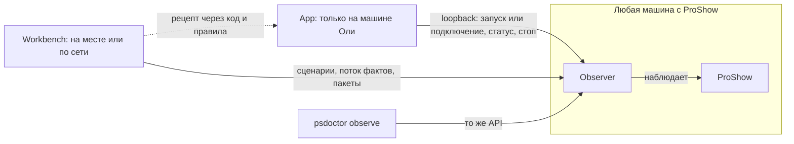

# Роли и сценарии

Статус: **сверено с владельцем 23.09.2026** по сценариям из памяти проекта. Главное: **App применяет готовые рецепты, рецепты создают инженер и агент** — на Workbench, стенде и опытах. Ниже — кто, где, какие сценарии и что осталось решить; подробности каждого сценария и дословные слова владельца — в разделе «Сценарии, сверенные с владельцем». Наглядно — [карта](map.html).

## Кто

| Роль | Кто это | Поверхность | Что делает |
| --- | --- | --- | --- |
| Монтажёр | Оля; без технической подготовки, зарабатывает в ProShow | App | работает как привыкла; получает совет с понятным действием, когда Doctor узнал известную проблему |
| Инженер | автор программы и настройщик; сегодня это владелец | Workbench | ставит опыты, ищет паттерны, создаёт рецепты, ставит и обновляет Doctor |
| Агент | Claude Code на машине разработки | `psdoctor observe`, код | вместе с инженером разбирает журналы и пакеты, закрепляет найденное в коде и правилах |

## Части и кто кого вызывает

Observer — один движок на каждой машине с ProShow: запускает программу или подключается к ней, снимает факты, держит ETW через повышенного помощника, хранит журналы сеансов. App, Workbench и `psdoctor observe` — клиенты одного API; своей логики наблюдения нет ни у одного. App активных команд программе не посылает никогда.

## Машины

Workbench безразличен к тому, к какой машине он подключён: стенд и машина Оли для него одинаковы.

| Машина | ProShow и Observer | App | Workbench | Для чего |
| --- | --- | --- | --- | --- |
| Машина Оли | да; Observer слушает loopback, сеть — по настройке | да | на месте или по локальной сети | работа Оли; опыты на её материале по договорённости |
| Стенд (ВМ) | да; Observer доступен по сети | нет | по сети или на месте | опыты без человека, откат снимками |
| Машина разработки | нет | нет | да | клиент стенда и машины Оли; здесь агент разбирает пакеты |

## Сценарии

| № | Сценарий | Кто начинает | Части | Состояние на 23.09.2026 |
| --- | --- | --- | --- | --- |
| М1 | Приём проекта: бросила `.psh` на Doctor или открыла через него → осмотр → совет | Оля | App, Core | подтверждён; холодная проверка реализована |
| М2 | «Решить проблему»: симптом → восстановление служебных файлов → после двух неудач наблюдение | Оля | App, Observer | реализовано, со слов владельца скорее проверено |
| М3 | Неоптимальный материал: сообщить; кнопка зовёт внешний перекодировщик с готовыми параметрами | Оля | App, Core, инструменты | подтверждён; рекомендации есть, кнопки нет |
| М4 | Запуск или подключение под наблюдением → совпало с известным паттерном → совет | Оля | App, Observer | подключение реализовано (Э4.3), не проверено; распознавания паттернов нет |
| М5 | Дежурство: Doctor сам наблюдает каждый запуск ProShow | никто, само | App, Observer | условно: только после замера цены; до первых рецептов пишет и молчит |
| М6 | Откат к резервному срезу `.bNN`: шкала по времени, человеческие различия, восстановление в копию | Оля | App, Core | подтверждён; не реализован |
| И1 | Опыт: сценарий, рендер, изменение проекта или материала, повтор | инженер или агент | Workbench или CLI, Observer | работает на стенде; на машине Оли — тем же путём |
| И2 | Разбор записанного у Оли: подключиться к её Observer или увезти пакет | инженер, агент | Workbench, Observer | подключение есть; вид пакета с её машины и срок хранения журналов не решены |
| И3 | Рецепт: паттерн найден → закреплён в коде или правилах → доставлен в App | инженер и агент | Core, Observer, App, установщик | устройство решено, не реализовано |
| И4 | Установка и обновление | инженер | установщик | на стенд — скрипт; нужен установщик с обновлением |

**Отложено:** сопровождение (открытие через Doctor с гигиеной и замером) — маловероятно, его замер уходит в И1; прокси-монтаж — «в дальний ящик»; подёргивание — исследуется в И1, может дать рецепт.

## Модель: знание течёт от Workbench к App

Статус: **согласовано** владельцем 23.09.2026.

Workbench ищет паттерн → паттерн закрепляется в коде или данных правил → App его применяет.

- **Workbench — лаборатория.** Поиск паттернов, опыты по многу раз с изменением проекта, анализ. Работает там, где есть Observer: на стенде или на машине Оли — по сети или локально, ему всё равно. Оле не показывается — для неё он «страшное чудище».
- **App — применение известного.** Не отладчик и не обязан собирать материал для расследования. Запускает ProShow под наблюдением или подключается к нему, сверяет телеметрию с известными паттернами и при совпадении даёт совет с действием («перекодируйте входящее видео», «эта картинка битая — на обращении к ней ProShow виснет»). Не совпало — молчит. Что барахлит и рецепта не имеет — исследует инженер.
- **Observer — один движок на каждой машине с ProShow**, различается настройкой. У Оли слушает только loopback, App говорит с ним через него; на стенде доступен по сети. Сеть — другой адрес, а не другой режим.
- **Журнал копится у Observer побочно.** App его не читает; Workbench, подключённый к её Observer, находит записанное на месте. Нужен срок хранения.
- **Пакет файлом нужен для агента**: он работает на машине разработки и к Оле не ходит. Сеанс с её машины уезжает пакетом на разбор.
- **Сеть к машине Оли извне** — на потом, как решено 15.09.2026 («не закладывать удалённое управление, которое никогда не пригодится»); если понадобится, это открытие адреса, а не переделка. Владелец считает нужными оба пути — файлом и по сети.

Новое требование: **паттерн должен доехать от Workbench до App**. Где живёт распознавание — в Core, Observer или App — отдельная развилка.

## Сценарии, сверенные с владельцем

Пересказ сценариев из памяти проекта (15–22.09.2026), каждый подтверждён или поправлен владельцем 23.09.2026.

**Приём проекта до работы** — подтверждён с поправкой. Оля копирует старый или чужой проект в папку нового заказчика и сохраняет под новым именем; до того как она вложила в него день, Doctor его осматривает и, если есть что предложить кнопкой, говорит одной фразой. Doctor узнаёт о проекте только двумя путями: Оля бросила `.psh` на Doctor или открыла проект через Doctor. **За папками Doctor сам не следит** — отменяет повод «новый проект в отслеживаемой папке» из tier1 и «отслеживаемую папку» в настройках.

**Открыть проект через Doctor с гигиеной и замером загрузки** («сопровождение» из памяти 15.09) — владелец считает маловероятным для Оли. Программная оптимизация проектов Doctor'ом под большим вопросом: это стало очевидно на первых же прогонах хранилища. Часть сценария поглощается сценарием инженера с Workbench; какая именно — фиксируется при разборе того сценария. Для App остаётся обычное открытие `.psh` без диагностики.

**Дежурство** — подтверждено условно. Оля открывает проект как обычно; Doctor сам замечает запуск ProShow и наблюдает за ним ради выявления плохих паттернов работы — **если измерено, что наблюдение не добавляет машине заметных тормозов**. Цена наблюдения — условие, а не подробность: без замера режим не включается по умолчанию. Замер цены пассивного наблюдения с ETW уже стоит критерием 6 Э4.3. Пока паттерны не найдены инженером по журналам и не закреплены детекторами, дежурство только записывает и молчит.

**Неоптимальный материал** — подтверждено с поправкой. Главное — донести до Оли, что входной материал неоптимален: кодек, несъедобный для ProShow (возможно, выяснится, что с какими-то форматами он работает сильно хуже), огромное видео, «и ещё что-то»; состав признаков — предмет наработки. Владелец: «Автоматически делать что-то с материалом опасно, как показали первые тесты. Фиг его знает, что Ольга с этим материалом делает. Сообщить - да. Однозначно.» Своего перекодировщика в Doctor не будет: «Позвать ffmpeg или handbreak, но так чтобы не заставлять Ольгу десяток параметров вписывать, это - да. Наверное.» Значит, у рекомендации может быть кнопка, которая открывает внешний перекодировщик с уже подставленными параметрами; исходник не трогается.

**Брак в готовом фильме (подёргивание)** — сейчас предмет исследования на стенде, а не сценарий App. Оля брак видит глазами при просмотре результата, но не понимает ни причины, ни лечения и начинает метаться: подрезать клип, сменить выходное разрешение. Гипотеза — разнобой частот кадров входных видео, лечение — перекодировка к одной частоте заранее; обе не подтверждены. Из исследования может родиться правило для Doctor. Естественный сценарий для Оли, когда правило и лечение появятся: дать Doctor посмотреть на проект и понаблюдать за рендером. Это пример модели выше: Workbench исследует, App применяет найденное.

**Опыты инженера** — подтверждено с поправкой. Загрузить проект, запустить рендер, оценить; изменить проект или входные файлы; повторить — много раз, сценарием без человека. **Workbench безразличен к тому, где стоит Observer**: стенд в VirtualBox и машина Оли в локальной сети для него одинаковы. Опыты идут не только на стенде; когда и как — договорённость владельца с Олей, а не правило программы. Отдельного режима «машина монтажёра» с запретами у Observer нет. Обещание field-ui «за Олю не нажимают» относится к App: App активных команд не посылает никогда. От столкновения с её работой защищает то, что уже есть: `launch` отказывает при запущенном ProShow, пассивный сеанс команд не принимает.

**Установка и обновление** — подтверждено с уточнением. Нужен установщик, умеющий обновлять установленное. Нынешний путь стенда «не так и плохо»: запускается с флэшки, раскладывает лежащее рядом по папкам установки, обновляет — «но это и есть установщик». Настраивает один раз инженер: права администратора для ETW берутся при установке, инструменты (ffmpeg, ImageMagick, редактор) назначаются и проверяются; пропавший или не настроенный инструмент — жалоба, Оле — «позовите администратора» (решение 15.09.2026). Установщик же снимает с App переменные окружения: адрес и ключ Observer кладутся при установке.

**Откат к резервному срезу** — нужен, «один из очевидно полезных и несложных механизмов». ProShow сам кладёт рядом с проектом срезы `.b01`–`.b09` и `.bak`. Оля откатываться умеет, но забывает, и сравнить файлы не может: `.psh` — текст, но для неё нечитаемый. Doctor показывает шкалу срезов по времени компьютера (создание и изменение резервных копий) и человеческие различия: «тут добавлен слайд хх», «тут добавлено видео». Восстановление — в новую копию, текущий `.psh` не трогается (предложение из разбора 22.09.2026). Не установлено: какой файл ProShow считает рабочим автосохранением и как нумерует срезы; годность среза проверяется опытом.

**Прокси-монтаж** (лёгкие копии видео для монтажа, оригиналы к финальному рендеру, переключатель «редактирование / финальная сборка») — «в дальний ящик», не снимается.

**Удобство App.** Владелец 23.09.2026, к откату срезов и к App в целом: «должно быть удобно (!) Удобство и интуитивная понятность вообще во главе угла App.»

## Развилки

Все развилки раунда по ролям закрыты владельцем 23.09.2026.

- ~~Как Observer живёт на машине Оли~~ — **решено владельцем 23.09.2026: как на стенде плюс сторож.** Observer — процесс в сеансе пользователя, ETW-помощник — с наивысшими правами, оба ставит установщик. Сторож замечает зависший или упавший Observer, перезапускает его и пишет факт. Короткоживущий процесс на сеанс («зонд») — только если зависания Observer подтвердятся.
- ~~Откуда у ETW права~~ — **решено владельцем 23.09.2026: однократно при установке**, без запроса UAC на каждый сеанс.
- ~~Где живёт распознавание паттернов (И3)~~ — **решено владельцем 23.09.2026.** Детектор — чистый код в Core: факты на входе, эпизод на выходе («крутит перечитывание файла X»); тестируется на Linux по записанным журналам. Выполняется в Observer: эпизод пишется в журнал обычным фактом, его видят и App, и Workbench. App только переводит эпизод во фразу и кнопку — слова остаются в App. Рецепт доезжает до App обновлением через установщик; пороги детектора — данные, меняются без пересборки. Эпизод — не вердикт: граница Observer «вердиктов не выносит» уточняется при сверке.
- ~~Пакет сеанса и срок хранения журналов~~ — **решено владельцем 23.09.2026.** Пакет делает только Workbench, в виде `exchange/checks/<id>`: журнал, сырой ETW по флажку, метаданные; на флэшку или в общую папку. App пакетов не делает. Observer хранит журналы в пределах срока и объёма — что наступит раньше, старое удаляется первым; сеансы с эпизодами детектора и сеансы, начатые мастером, живут дольше. Числа — настройка установщика; первые значения — из замера веса сырого ETW за рендер.
- Как App находит Observer — закрывается установщиком: адрес и ключ кладутся при установке.
